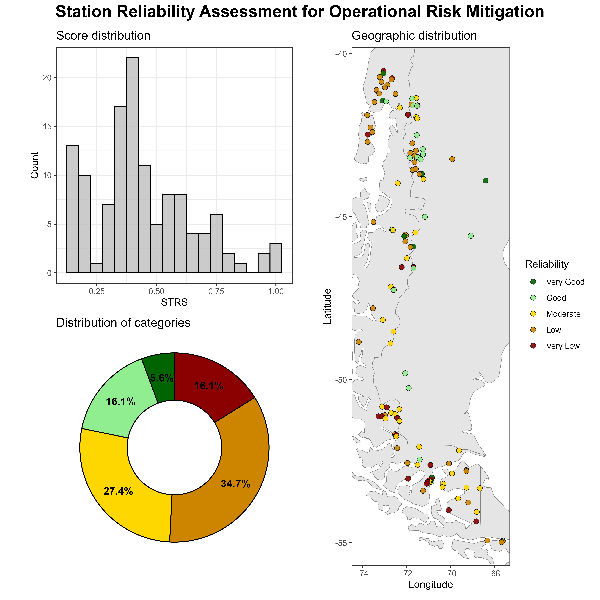

# 🔍 Environmental Data Quality Framework for Business Risk Mitigation

## 📌 Executive Summary

This project builds a quantitative environmental data reliability framework that converts raw monitoring station records into a structured **risk scoring system**.

It is designed to reduce downstream model risk, financial mispricing, and operational exposure in climate-sensitive industries by introducing a reproducible, governance-oriented data quality layer before predictive modeling.

---

## 🚩 Problem Context

In climate-sensitive industries (energy, insurance, infrastructure, agriculture), environmental datasets are frequently assumed to be reliable without structured validation.

However, station networks typically suffer from:

* Incomplete temporal records
* Seasonal measurement bias
* Operational outages
* Uneven historical depth
* Silent data degradation

Using low-quality stations in predictive models, risk pricing, or infrastructure planning introduces **model risk, financial mispricing, and operational blind spots**.

This framework converts raw daily environmental observations into a **quantitative risk-based reliability index**.

---

## 🎯 Strategic Applications

This framework enables risk-aware decision-making in climate-sensitive industries:

* **Hydropower & Renewable Energy**: Improves inflow modeling, generation forecasting, and asset risk evaluation by filtering unreliable environmental inputs.
* **Agriculture & Agri-Finance**: Strengthens yield modeling, drought risk assessment, and crop insurance pricing through structured data validation.
* **Insurance & Financial Risk**: Reduces model risk in climate exposure pricing and parametric insurance design.
* **Infrastructure & Water Management**: Supports flood planning, reservoir operations, and long-term resilience analysis.
* **Extractive Industries (Mining & Natural Resources)**: Enhances operational safety planning, water resource management, and climate exposure assessment in remote or climate-sensitive operations.
* **Remote Sensing & Environmental Intelligence**: Supports station calibration, hybrid ground-satellite validation, and weighted data integration for climate analytics platforms.
* **Banking & Climate Stress Testing**: Improves the robustness of climate scenario inputs used in financial risk modeling, portfolio exposure analysis, and regulatory stress testing frameworks.
* **Data Science & Predictive Modeling**: Acts as a governance layer for environmental data pipelines before ML training or risk modeling.

This project demonstrates how environmental data quality can be transformed into structured Risk Intelligence for business decision-making.

👉 Full Risk Intelligence report available here: [View Report](https://www.notion.so/Environmental-Data-Quality-Framework-for-Business-Risk-Mitigation-30e43fe0ba2e80388e0df2797886b686)

---

## 🧠 Technical Architecture

The system implements an end-to-end analytical pipeline:

1. **Data ingestion** (metadata + daily time series)
2. **Automated validation checks**
3. **Feature engineering of data quality indicators**
4. **Temporal aggregation at multiple scales**
5. **Metric standardization**
6. **Weighted risk scoring**
7. **Tier-based segmentation**
8. **Executive-level diagnostics visualization**
9. **BI-ready dataset export**

---

## 📊 Station Reliability Score (STRS)

This is te core output. A composite metric derived from five orthogonal quality dimensions:

| Metric                  | Risk Dimension Captured      |
| ----------------------- | ---------------------------- |
| Total Coverage (TC)     | Structural data availability |
| Mean Completeness (MC)  | Operational continuity       |
| Seasonal Depth (SD)     | Calendar representativeness  |
| Seasonal Stability (SS) | Intra-annual consistency     |
| Temporal Depth (TD)     | Historical robustness        |

It is computed as a weighted linear aggregation:

$$
STRS =
w_{TC} \cdot TC +
w_{MC} \cdot MC +
w_{SD} \cdot SD +
w_{SS} \cdot SS +
w_{TD} \cdot TD
$$

Default weights reflect operational risk priorities:

* Structural availability (30%): $w_{TC} = 0.30$
* Operational continuity (25%): $w_{MC} = 0.25$
* Seasonal representativeness (15%): $w_{SD} = 0.15$
* Stability (10%): $w_{SS} = 0.10$
* Historical robustness (20%): $w_{TD} = 0.20$

The Temporal Depth component applies an exponential saturation function to prevent overweighting extremely long records while rewarding fully complete years.

This design mirrors risk scoring approaches used in:

* Credit scoring systems
* Asset quality ratings
* Infrastructure risk profiling

---

## 🏷️ Risk Segmentation Framework

Stations are classified into five reliability tiers:

* Very Good
* Good
* Moderate
* Low
* Very Low

This tiering enables:

* Risk-adjusted station selection for modeling
* Data filtering before ML training
* Weighted ensemble modeling strategies
* Portfolio-level monitoring dashboards
* Governance reporting for data quality compliance

---

## 📊 Executive Outputs

The workflow generates:

### 1️⃣ BI-Ready Dataset

`outputs/station_quality_scores.csv`

Each row represents a monitoring station with engineered reliability features.

**Dataset Structure**

| Column                | Description                              |
|-----------------------|------------------------------------------|
| station_id            | Unique station identifier                |
| gauge_name            | Station name                             |
| institution           | Operating institution                    |
| gauge_lat             | Latitude                                 |
| gauge_lon             | Longitude                                |
| gauge_alt             | Elevation (m)                            |
| total_days_calendar   | Full calendar span (days)                |
| total_days_valid      | Valid observed days                      |
| TC                    | Total Coverage score                     |
| MC                    | Mean Monthly Completeness                |
| SD                    | Seasonal Depth                           |
| SS                    | Seasonal Stability                       |
| TD                    | Temporal Depth                           |
| STRS                  | Composite reliability score              |
| reliability           | Tier classification                      |

This structure is designed for:

* Risk-based filtering before modeling
* Dashboard integration (Power BI / Tableau)
* Portfolio-level monitoring
* Governance reporting
* Feature selection pipelines in ML workflows

### 2️⃣ Operational Risk Dashboard

A combined executive visualization including:

* Score distribution histogram
* Reliability segmentation analysis
* Geographic tier mapping

Enabling both technical validation and stakeholder communication.



---

## 🧩 Key Design Features

* Parameterized completeness thresholds
* Configurable weighting scheme
* Exponential reward modeling
* Active-station filtering logic
* Robust NA handling
* Fully reproducible R pipeline
* Business-oriented output design

The framework is modular and extensible to other environmental variables (temperature, wind, hydrology) or sensor-based IoT networks.

---

## 📂 Repository Structure

```
environmental-data-quality-framework/
├── data/
│ ├── PP_PMETobs_1950_2020_v11d.csv
│ └── PP_PMETobs_v11_metadata.csv
│
├── outputs/
│ ├── diagnostic_operational_risk_dashboard.png
│ └── station_quality_scores.csv
│
├── operational-risk-station-scoring.R
└── README.md
```
Description:

- **data/**: Raw precipitation observations and station metadata.  
- **outputs/**: Generated risk diagnostics, scoring results, and executive dashboard visualization.  
- **operational-risk-station-scoring.R**: Core scoring and risk classification pipeline.  
- **README.md**: Project documentation and strategic framing.

---

## 👤 Author

**Santino Adduca**  
Data & Risk Modeling | Environmental Analytics | Data Science  

If you would like to discuss this project or explore potential collaboration opportunities, feel free to reach out via email or connect with me on [LinkedIn](https://www.linkedin.com/in/santino-adduca/).
